# ChamaPesa

A smart chama (savings group) management platform built for Kenya. ChamaPesa automates the tedious, error-prone work of running a chama — M-Pesa collections, rotating payouts, loan management, goal-based savings pools, and anonymous voting — so groups can focus on growing together.

## About

### The Problem

Over 300,000 chamas operate in Kenya, managing billions of shillings. Most run on spreadsheets, WhatsApp groups, and manual M-Pesa transfers. This leads to:

- **Missed contributions** — no automated reminders or collection
- **Trust issues** — opaque records, disputed payments, no audit trail
- **Manual payouts** — treasurers manually sending M-Pesa to rotation recipients
- **No accountability** — loan defaults go untracked, penalties unenforced
- **Exclusion** — members without smartphones can't participate in decisions

### The Solution

ChamaPesa digitizes the entire chama lifecycle:

- Members contribute via **M-Pesa STK Push** — triggered automatically or on demand
- **Merry-go-round payouts** are sent instantly via M-Pesa B2C to the next member in rotation
- **Loans** are requested, voted on anonymously, and disbursed automatically on approval
- A **trust score** (based on payment history, tenure, and participation) replaces subjective trust
- **Goal-based pools** let chamas split contributions across emergency funds, investments, and savings targets
- Every transaction is recorded with M-Pesa receipts for full transparency

## Live Demo

🔗 **Live URL:** [https://d3czamd19a4so0.cloudfront.net](https://d3czamd19a4so0.cloudfront.net)

### Demo Credentials

| Name | Phone | PIN | Role |
|------|-------|-----|------|
| Amina Wanjiku | 0712345678 | 1234 | Admin |
| Brian Otieno | 0723456789 | 1234 | Treasurer |
| Cynthia Muthoni | 0734567890 | 1234 | Member |

Admin/Treasurer accounts access the full dashboard. Member accounts access the member portal.

## Screenshots

### Landing Page
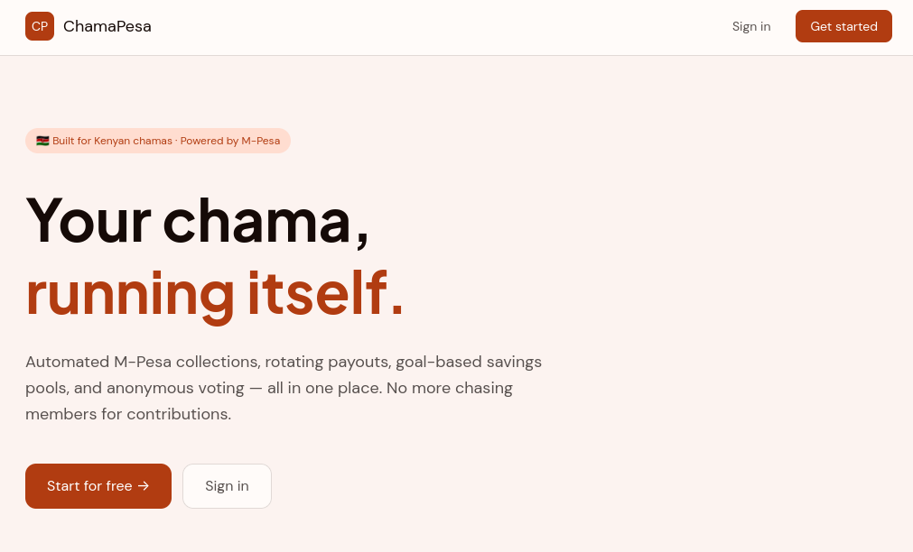

### Registration
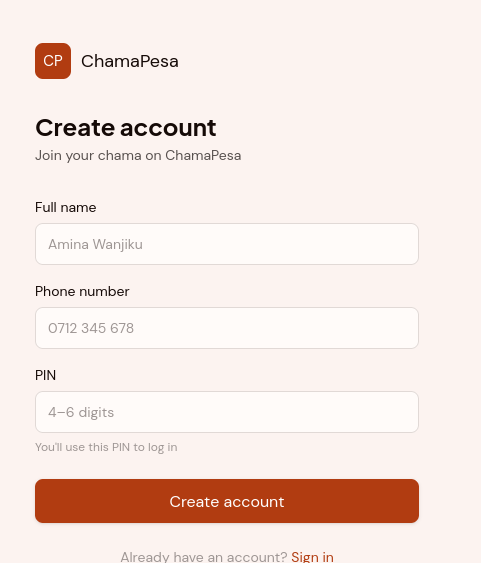

### Admin Dashboard
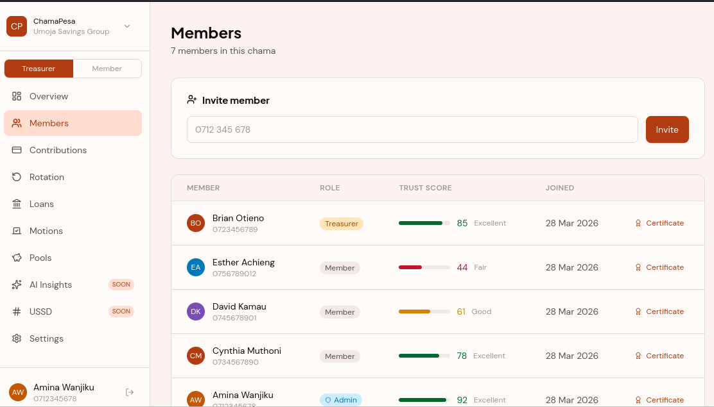

### Contributions
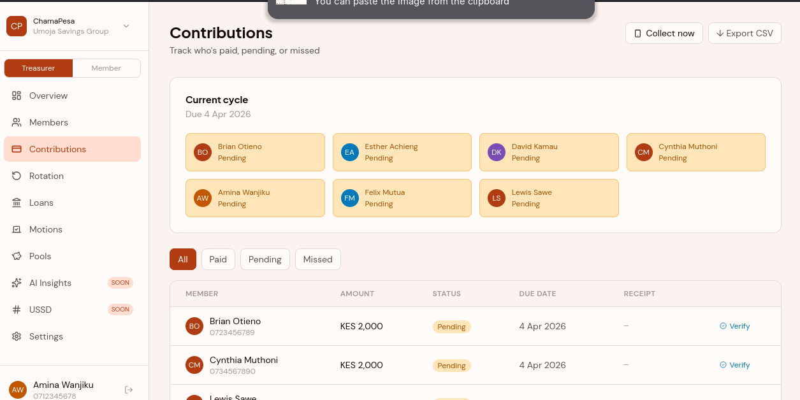

### Merry-Go-Round Rotation
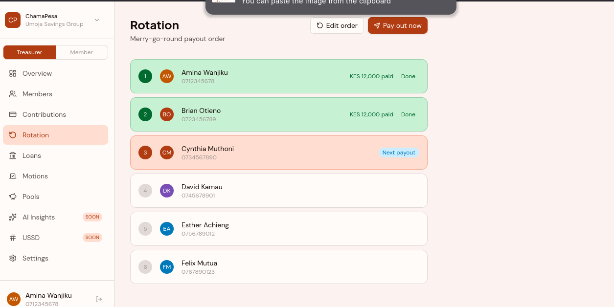

### Loans
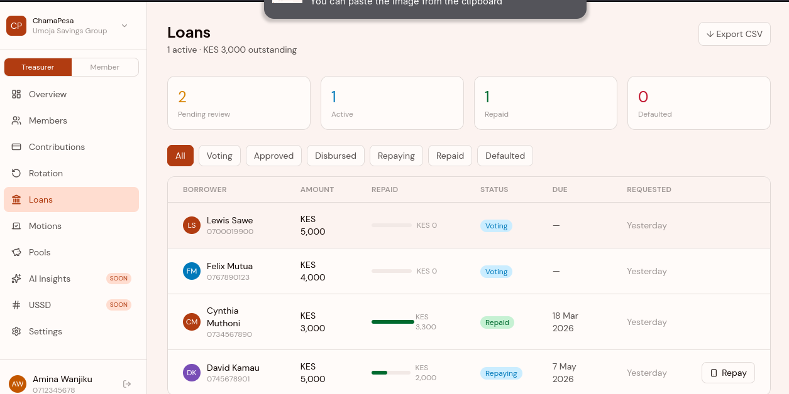

### Anonymous Voting
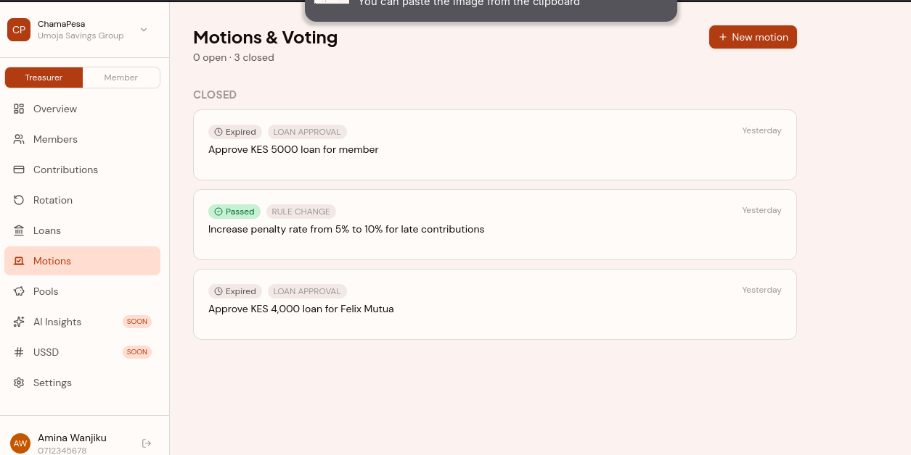

### Savings Pools
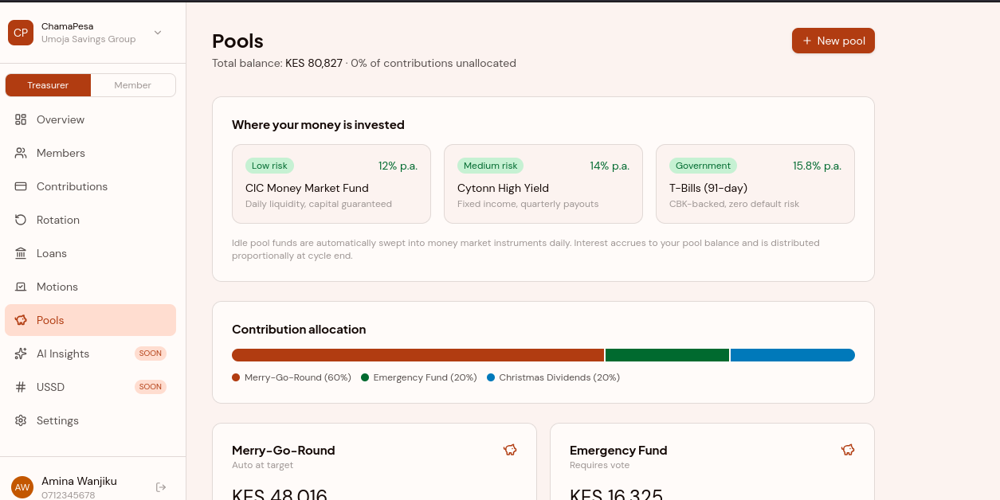

### Member Portal
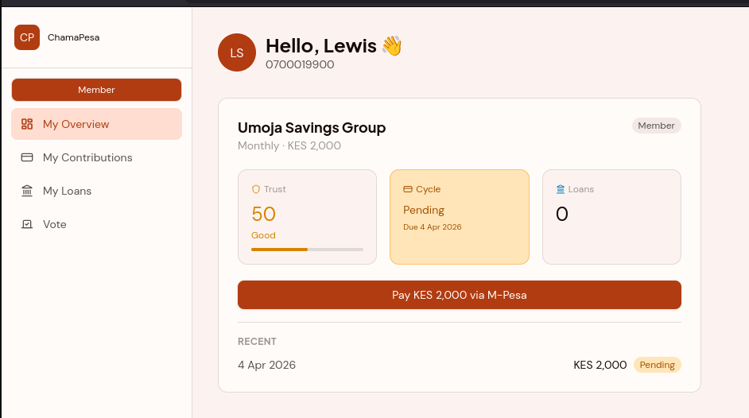

### Member Contributions
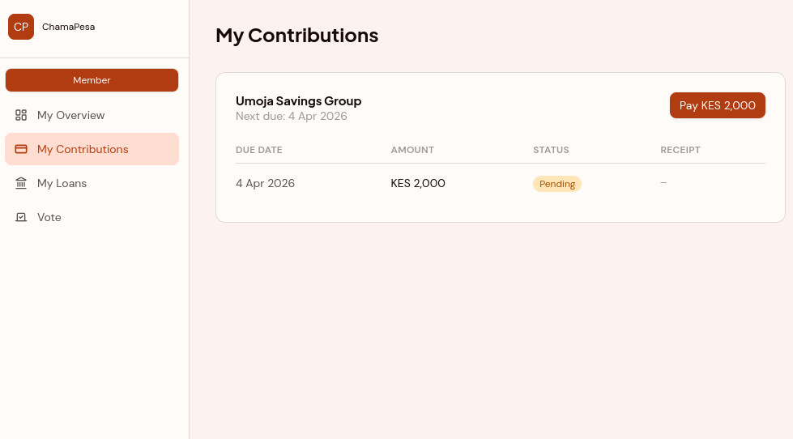

### Member Loans
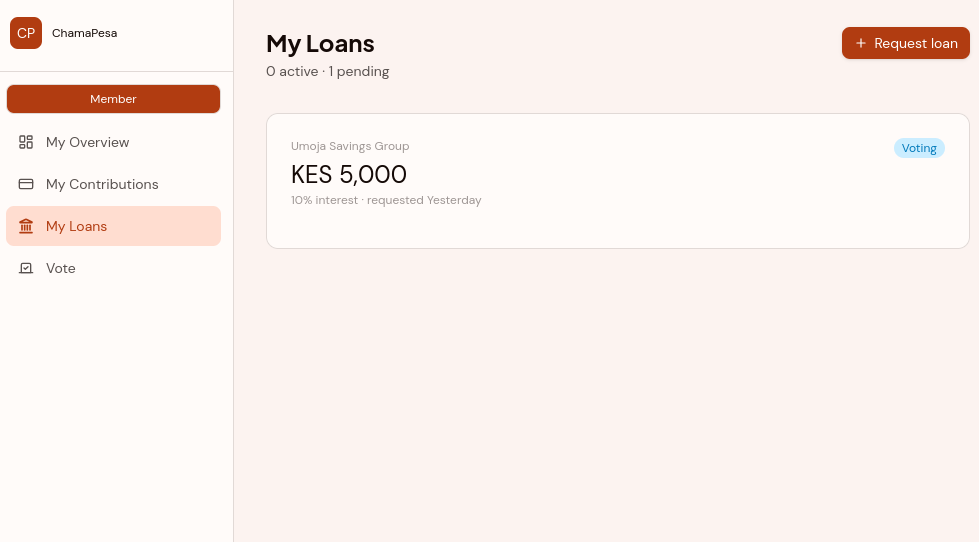

### Member Voting
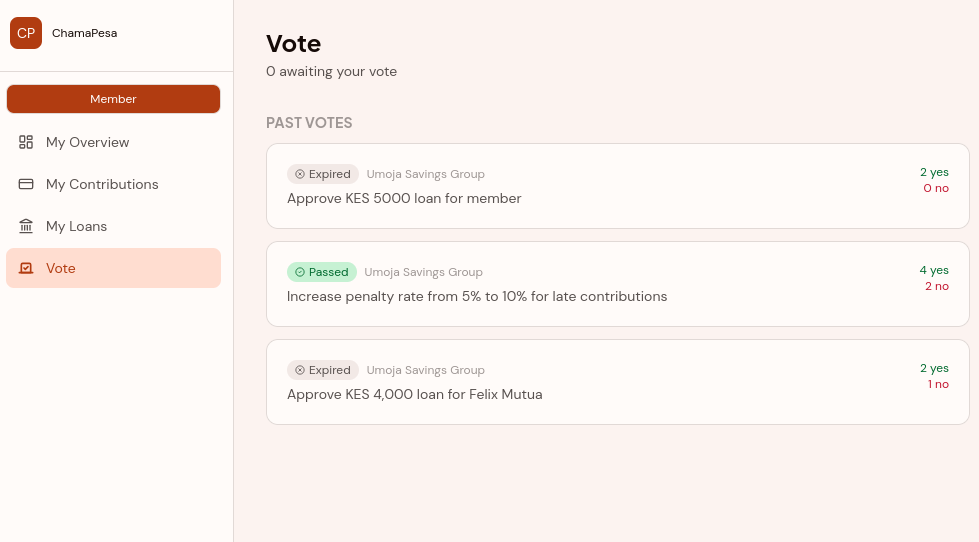

## Key Features

### M-Pesa Integration
- **STK Push** — trigger payment prompts to members' phones
- **B2C Payouts** — send rotation payouts and loan disbursements directly to M-Pesa
- **Transaction Status** — verify pending payments via Daraja API
- **Live feed** — real-time M-Pesa transaction log on the dashboard

### Chama Management
- Create chamas, invite members by phone number
- Set contribution amounts, frequency, and penalty rates
- Role-based access (Admin, Treasurer, Member)

### Merry-Go-Round
- Drag-to-reorder rotation schedule
- One-click "Pay Out Now" via M-Pesa B2C
- Automated daily payouts when all members have contributed

### Loans
- Request loans (requires trust score ≥ 50)
- Automatic anonymous vote created for each loan request
- Auto-disbursement via M-Pesa B2C on vote approval
- Repayment tracking with STK Push

### Anonymous Voting
- Create motions with configurable thresholds and deadlines
- Anonymous ballot — results hidden until voting closes
- Auto-execution on pass (e.g., loan disbursement)

### Savings Pools
- Goal-based pools (emergency fund, investment, education, etc.)
- Configurable contribution splits (must total 100%)
- Lock periods and withdrawal rules
- Interest accrual

### Trust Score
- Weighted score based on: on-time contributions (40%), loan repayment (25%), tenure (15%), voting participation (10%), penalty history (10%)
- Trust certificates for members

### Automated Operations
- 7am — SMS contribution reminders
- 8am — Auto STK Push to all members
- 9am — Auto B2C payout to next rotation member
- 11pm — Mark unpaid contributions as missed
- Every 30min — Expire voting motions past deadline
- 1am — Accrue pool interest

### Dashboard Views
- **Admin/Treasurer:** Overview, contributions, members, loans, motions, pools, rotation, settings
- **Member:** Personal overview, contributions, loans, voting

## Tech Stack

| Layer | Technology |
|-------|-----------|
| Backend | Node.js 22, TypeScript, Express.js |
| Database | PostgreSQL 16 (Prisma ORM) |
| Frontend | Next.js 15, React, Tailwind CSS |
| Payments | Safaricom Daraja API (STK Push, B2C, Transaction Status) |
| SMS | Africa's Talking |
| Scheduling | node-cron |
| Auth | JWT + bcrypt PIN hashing |
| Infrastructure | AWS ECS Fargate, RDS, ALB, CloudFront, ECR, Secrets Manager |
| IaC | Terraform |
| CI/CD | GitHub Actions |
| Containerization | Docker |

## Project Structure

```
ChamaPesa/
├── backend/
│   ├── prisma/
│   │   ├── schema.prisma          # 12 models, 8 enums
│   │   └── seed.ts                # Demo data seeder
│   ├── src/
│   │   ├── app.ts                 # Express entry point
│   │   ├── middleware/auth.ts     # JWT authentication
│   │   ├── routes/
│   │   │   ├── auth.ts            # Register / Login
│   │   │   ├── chama.ts           # CRUD, invite, rotation
│   │   │   ├── contribution.ts    # Pay via STK Push, history
│   │   │   ├── mpesa.ts           # Callbacks (STK, B2C)
│   │   │   ├── loan.ts            # Request, approve, repay
│   │   │   ├── motion.ts          # Voting & motions
│   │   │   └── pool.ts            # Savings pools
│   │   ├── services/
│   │   │   ├── mpesa.ts           # Daraja API integration
│   │   │   ├── sms.ts             # Africa's Talking
│   │   │   └── trustScore.ts      # Trust score engine
│   │   └── jobs/scheduler.ts      # Cron jobs
│   ├── .env.example
│   ├── Dockerfile
│   └── package.json
├── dashboard/
│   ├── app/                       # Next.js pages
│   ├── components/                # Shared UI components
│   ├── lib/                       # API client, auth, utils
│   ├── Dockerfile
│   └── package.json
├── infra/                         # Terraform (ECS, RDS, ALB, CloudFront, VPC)
├── deploy.sh                      # Build & deploy to AWS
├── docker-compose.yml             # Local PostgreSQL
└── .github/workflows/deploy.yml   # CI/CD pipeline
```

## Setup & Installation

### Prerequisites

- Node.js 22+
- Docker & Docker Compose
- ngrok (for M-Pesa callbacks in development)

### 1. Clone the repository

```bash
git clone https://github.com/your-org/chamapesa.git
cd chamapesa
```

### 2. Start PostgreSQL

```bash
docker-compose up -d
```

### 3. Configure environment

```bash
cp backend/.env.example backend/.env
```

Edit `backend/.env` and fill in your API keys:
- **Daraja credentials** — get from [developer.safaricom.co.ke](https://developer.safaricom.co.ke)
- **Africa's Talking** — get from [africastalking.com](https://africastalking.com)

### 4. Install dependencies & set up database

```bash
cd backend && npm install
npx prisma generate
npx prisma db push
```

### 5. Seed demo data (optional)

```bash
npm run seed
```

### 6. Run the backend

```bash
npm run dev
```

### 7. Run the dashboard

```bash
cd ../dashboard && npm install
npm run dev
```

### 8. Expose for M-Pesa callbacks (development)

```bash
ngrok http 3000
```

Update `MPESA_CALLBACK_URL` in `.env` with the ngrok URL.

### Verify

```bash
curl http://localhost:3000/health
# → {"status":"ok"}
```

- Backend: http://localhost:3000
- Dashboard: http://localhost:3001

## API Reference

### Authentication
| Method | Endpoint | Body | Description |
|--------|----------|------|-------------|
| POST | `/api/auth/register` | `{phone, name, pin}` | Register new user |
| POST | `/api/auth/login` | `{phone, pin}` | Login, returns JWT |

### Chamas
| Method | Endpoint | Description |
|--------|----------|-------------|
| POST | `/api/chamas` | Create chama |
| GET | `/api/chamas` | List my chamas |
| GET | `/api/chamas/:id` | Chama details with members, pools, rotation |
| POST | `/api/chamas/:id/invite` | Invite member by phone |
| POST | `/api/chamas/:id/rotation` | Set merry-go-round order |

### Contributions
| Method | Endpoint | Description |
|--------|----------|-------------|
| POST | `/api/contributions/pay` | Trigger M-Pesa STK Push |
| GET | `/api/contributions/chama/:chamaId` | All contributions for a chama |
| GET | `/api/contributions/mine/:chamaId` | My contributions |

### Loans
| Method | Endpoint | Description |
|--------|----------|-------------|
| POST | `/api/loans/request` | Request loan (trust score ≥ 50 required) |
| GET | `/api/loans/chama/:chamaId` | Chama loans |
| GET | `/api/loans/mine` | My loans |

### Motions & Voting
| Method | Endpoint | Description |
|--------|----------|-------------|
| POST | `/api/motions` | Create motion |
| POST | `/api/motions/:id/vote` | Cast anonymous vote |
| GET | `/api/motions/:id` | Motion details |
| GET | `/api/motions/chama/:chamaId` | Chama motions |

### Pools
| Method | Endpoint | Description |
|--------|----------|-------------|
| POST | `/api/pools` | Create pool |
| GET | `/api/pools/chama/:chamaId` | List pools |
| PUT | `/api/pools/splits/:chamaId` | Update splits (must total 100%) |

### M-Pesa Callbacks (called by Safaricom)
| Method | Endpoint | Description |
|--------|----------|-------------|
| POST | `/api/mpesa/callback/stk` | STK Push result |
| POST | `/api/mpesa/callback/b2c/result` | B2C payout result |
| POST | `/api/mpesa/callback/b2c/timeout` | B2C timeout |

All endpoints except auth and callbacks require `Authorization: Bearer <token>`.

## AWS Deployment

The app runs on AWS using ECS Fargate, RDS PostgreSQL, CloudFront (HTTPS), and an Application Load Balancer.

```
Internet → CloudFront (HTTPS) → ALB → /api/* → ECS (backend:3000)
                                     → /*    → ECS (dashboard:3001)
                                                    ↓
                                              RDS PostgreSQL (private subnet)
```

Infrastructure is defined in `infra/` using Terraform. See the deploy instructions in `infra/` or run:

```bash
cd infra && terraform apply -var-file="secrets.tfvars"
./deploy.sh
```

### CI/CD

Deployments are automated via **GitHub Actions**. Every push to `main` triggers the pipeline at `.github/workflows/deploy.yml`, which:

1. Builds and pushes Docker images to ECR
2. Rebuilds the dashboard with the production API URL
3. Forces ECS to redeploy both services

**Required GitHub Secrets:**

| Secret | Description |
|--------|-------------|
| `AWS_ACCESS_KEY_ID` | IAM access key with ECR + ECS permissions |
| `AWS_SECRET_ACCESS_KEY` | IAM secret key |
| `CLOUDFRONT_DOMAIN` | CloudFront distribution domain (e.g. `d1234abc.cloudfront.net`) |

## Team

| Name | Role |
|------|------|
| Rodwell Leo | Backend |
| Sebastian Wanjala | Frontend |
| Eric Owuor | Backend |
| Jeddy Chella | Backend |
| Brigit Melbride | Data Science |
| Lewis Sawe | Cybersecurity |

## License

MIT
